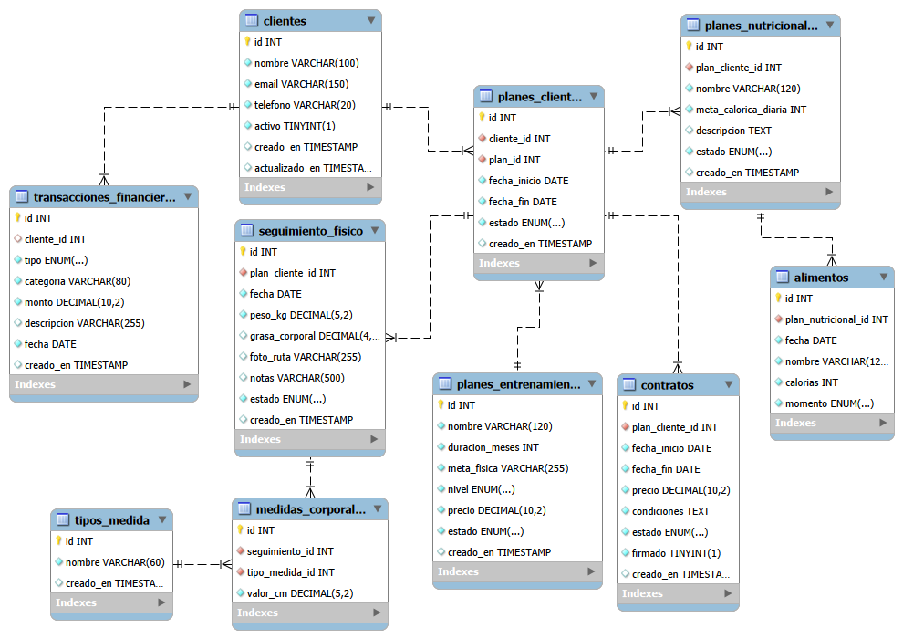

# GymCLI — Sistema de Gestión de un Gimnasio

Aplicación de línea de comandos (CLI) en Node.js con persistencia en MySQL para que un entrenador personal o gimnasio gestione clientes, planes de entrenamiento, contratos, seguimiento físico, nutrición y finanzas.

## Tecnologías

Node.js (ES Modules) · MySQL 8 · mysql2/promise · inquirer 8.2.5 · chalk · dotenv · dayjs

## Instalación

1. Clona el repositorio y entra en el directorio del proyecto.
2. Instala las dependencias, configura `.env` y ejecuta el esquema con los comandos correspondientes a tu sistema operativo.
1. Clona el repositorio y entra en el directorio del proyecto.
2. Instala las dependencias, configura `.env` y ejecuta el esquema con los comandos correspondientes a tu sistema operativo.


### Linux / macOS / Git Bash

```bash
git clone <URL-DEL-REPO>
cd gymcli_nodejs
npm install
cp .env.example .env # Coloca tu user y password de MySQL 
mysql -u root -p < database/schema.sql
node app.js
```

## Exportar progreso de un cliente

Desde el menú principal selecciona **Exportar progreso de cliente**.
```

El archivo se crea en `exports/cliente_<nombre>_progreso.json`; contiene datos del cliente. Los datos se consultan desde MySQL, que es la persistencia configurada por esta aplicación.

## Respaldos y restauración

Los archivos se guardan en `backups/` con fecha y hora.

Desde el menú principal entra a **Respaldo y restauración**. Puedes crear un respaldo completo o elegir tablas. Para restaurar, selecciona el archivo; deja la ruta vacía para cancelar y confirma con Sí/No. El respaldo debe ser completo y tener el mismo esquema.

### Windows (PowerShell)
```bash
git clone <URL-DEL-REPO>
cd gymcli_nodejs
npm install
Copy-Item .env.example .env # Coloca tu user y password de MySQL 
Get-Content database/schema.sql | & "C:\Program Files\MySQL\MySQL Server 8.0\bin\mysql.exe" -u root -p
node app.js
```

## Variables de entorno (`.env`)

| Variable | Descripción |
|---|---|
| `DB_HOST` | Host de MySQL (`localhost`) |
| `DB_PORT` | Puerto de MySQL (`3306`) |
| `DB_USER` | Usuario de MySQL |
| `DB_PASSWORD` | Contraseña de MySQL |
| `DB_NAME` | `gymcli_db` |

## Estructura del proyecto

```text
gymcli_nodejs/
|-- .env.example
|-- .gitkeep
|-- app.js
|-- package.json
|-- package-lock.json
|-- README.md
|-- commands/        # Menús y acciones disponibles en la CLI
|-- config/          # Configuración de la conexión a MySQL
|-- database/        # Esquema SQL de la base de datos
|-- docs/            # Documentos y recursos del proyecto
|-- factories/       # Creación de objetos con lógica común
|-- models/          # Entidades y validaciones de los datos
|-- repositories/    # Consultas y acceso a la base de datos
|-- services/        # Reglas y operaciones del negocio
`-- utils/           # Funciones auxiliares reutilizables

```


## Patrones de diseño aplicados

- **Repository** (`/repositories`): separa el acceso a MySQL de la lógica de negocio. Cada entidad tiene su propio repositorio (`ClienteRepository`, `ContratoRepository`, etc.), lo que permite cambiar de motor de base de datos sin tocar los servicios.
- **Factory** (`factories/ContratoFactory.js`): centraliza el cálculo de fechas de vigencia de un contrato (inicio + duración del plan) para no repetir esa lógica en `asignarPlan` y en `renovar`.

## Principios SOLID

- **SRP:** cada modelo valida solo su propia entidad; cada repositorio solo hace queries de su tabla.
- **DIP:** los servicios reciben sus repositorios por constructor (`constructor(repo = new XRepository())`), no los crean acoplados — se pueden inyectar mocks para testing.
- **OCP:** agregar una medida corporal nueva (ver `tipos_medida`) no requiere modificar `SeguimientoService` ni el esquema.

## Operaciones críticas (transacciones SQL)


| Operación | Archivo | Qué garantiza |
|---|---|---|
| Asignar plan + generar contrato | `services/ContratoService.js` → `asignarPlan` | Si falla el contrato, se revierte la asignación |
| Cancelar plan | `services/ContratoService.js` → `cancelar` | Cascada a seguimiento/nutrición solo si el contrato estaba firmado; ROLLBACK ante cualquier fallo |
| Finalizar plan | `services/ContratoService.js` → `finalizar` | Cierre consistente de contrato + plan + nutrición |
| Renovar plan | `services/ContratoService.js` → `renovar` | Nuevo contrato + extensión de fechas en una sola transacción |
| Registrar seguimiento + medidas | `services/SeguimientoService.js` → `registrar` | El registro y sus medidas se guardan juntos o no se guarda nada |
| Registrar transacción financiera | `services/FinanzasService.js` → `registrar` | Nunca queda un ingreso/egreso a medio insertar |

## Estructura de la base de datos


## Video demostrativo
<a href="https://drive.google.com/drive/folders/1WAUFzsW_LPXaBaJkbBFl0G-p1L-lTTzK?usp=sharing">Haz clic aquí</a>


**Autora:** Jakelin Quino
